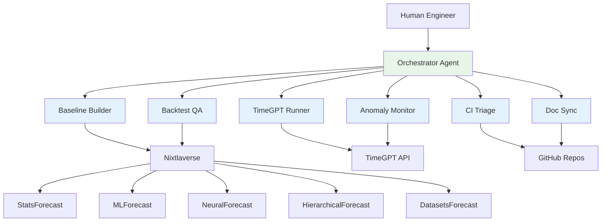

# Nixtla Agentic Engineering Workspace (Private)

> A Bob-style multi-agent system that wraps Nixtla's time series stack to prototype "junior engineer" agents for internal use.

[](https://github.com/jeremylongshore/claude-code-plugins-nixtla)
[](https://github.com/jeremylongshore/bobs-brain.git)
[](https://docs.nixtla.io/)
[](./LICENSE)

> **Status**: Experimental | Private collaboration workspace between Jeremy Longshore (Intent Solutions) and Max Mergenthaler (Nixtla)

---

## Nixtla Baseline Lab – Forecasting Plugin Overview

**The Nixtla Baseline Lab** is a production-ready Claude Code plugin that runs Nixtla OSS baseline forecasting models (SeasonalNaive, AutoETS, AutoTheta) on benchmark datasets (M4) and custom CSV files directly inside Claude Code conversations. It provides AI-powered interpretation via a Skill, generating reproducible metrics (sMAPE, MASE) with optional visualization and TimeGPT comparison.

**Current Status**: ✅ **v0.6.0 RELEASED** – Production-ready with CI validation, golden task harness, and comprehensive documentation.

### What It Is (Purpose)

The Nixtla Baseline Lab is a Claude Code plugin that enables time series forecasting workflows inside your editor. It runs Nixtla's open-source baseline models (SeasonalNaive, AutoETS, AutoTheta) on public benchmark datasets (M4 Daily) or custom CSV files, generates metrics (sMAPE, MASE), and optionally compares results against Nixtla's TimeGPT foundation model. An AI Skill interprets results, explaining which models performed best and why, making baseline evaluation accessible to both technical and business stakeholders.

### Who It's For

- **Nixtla CEO / Leadership** – Quickly validate baseline performance and compare against TimeGPT without writing code
- **Technical Collaborators** – Run reproducible baseline experiments with standardized evaluation methodology
- **Data Scientists & ML Engineers** – Benchmark custom datasets against M4 standards
- **Plugin Developers** – Reference implementation demonstrating all Claude Code plugin capabilities (Commands, Skills, Agents, MCP servers)

### When to Use It

- **Validating Nixtla OSS baselines** on M4 Daily benchmark dataset with reproducible metrics
- **Sanity-checking custom time series** by uploading CSV files and comparing to M4 performance
- **Quick baseline vs TimeGPT comparisons** on small samples (3-5 series) for directional insights
- **Exploring forecasting workflows** before building production pipelines
- **CI validation** – Ensuring baseline models produce expected metrics ranges on every code change

### Where It Runs

- **Inside Claude Code** – Installed as a plugin via the local marketplace (`nixtla-dev-marketplace`)
- **Python Environment** – Runs in virtualenv (`.venv-nixtla-baseline`) with isolated dependencies
- **GitHub Actions CI** – Automated testing on every push/PR to main branch
- **Platform Support** – Ubuntu/Linux (primary), macOS (recommended), Windows (via WSL)

### How It Works – User Journey

1. **Clone and Trust**: Clone this repo and trust the folder in Claude Code
2. **Install Plugin**: Run `/plugin install nixtla-baseline-lab@nixtla-dev-marketplace` (marketplace auto-discovered)
3. **Setup Environment**: Run `/nixtla-baseline-setup` or use `./scripts/setup_nixtla_env.sh --venv` for Python deps
4. **Run Baseline**: Execute `/nixtla-baseline-m4 horizon=7 series_limit=5` for M4 Daily benchmark
5. **Ask AI Skill**: "Which baseline model performed best overall and why?" – AI reads metrics and explains
6. **Optional Features**:
   - **Custom CSV**: `--dataset-type csv --csv-path /path/to/data.csv`
   - **Plots**: `--enable-plots` for PNG forecast visualizations
   - **TimeGPT Comparison**: `--include-timegpt` with `NIXTLA_TIMEGPT_API_KEY` set
7. **Review Results**: CSV metrics (`results_M4_Daily_h7.csv`), summary TXT, optional plots/showdown reports

### Goals & Guarantees

When CI is green (✅ passing):

- ✅ **Baseline runs produce valid outputs** – CSV with sMAPE/MASE columns in expected ranges (sMAPE: 0-200%, MASE: >0)
- ✅ **Golden task harness passes** – 5-step validation on every push (CSV schema, metrics ranges, summary content)
- ✅ **Setup script succeeds** – All dependencies install correctly on Ubuntu/Linux; macOS recommended; Windows via WSL
- ✅ **TimeGPT is opt-in** – Never breaks baseline runs; gracefully skips if API key missing (exit code 0)
- ✅ **CI artifacts uploaded** – Test results preserved for 7 days even on failures
- ✅ **Clear error messages** – No raw tracebacks; structured JSON responses with actionable error messages

### Reference Docs

**Plugin Manual**:
- **[plugins/nixtla-baseline-lab/README.md](./plugins/nixtla-baseline-lab/README.md)** – Complete user guide with setup, usage, and examples

**Product & Architecture**:
- **[000-docs/6767-OD-OVRV-nixtla-baseline-lab-product-overview.md](./000-docs/6767-OD-OVRV-nixtla-baseline-lab-product-overview.md)** – Product overview (Who/What/When/Where/Why) + user journey
- **[000-docs/6767-OD-ARCH-nixtla-claude-plugin-poc-baseline-lab.md](./000-docs/6767-OD-ARCH-nixtla-claude-plugin-poc-baseline-lab.md)** – Technical architecture and design decisions
- **[000-docs/6767-PP-PLAN-nixtla-claude-plugin-poc-baseline-lab.md](./000-docs/6767-PP-PLAN-nixtla-claude-plugin-poc-baseline-lab.md)** – Implementation roadmap and phase breakdown

**Phase After-Action Reports (AARs)**:
- **[015-AA-AACR-phase-01-structure-and-skeleton.md](./000-docs/015-AA-AACR-phase-01-structure-and-skeleton.md)** – Plugin scaffolding, marketplace setup, initial structure
- **[016-AA-AACR-phase-02-manifest-and-mcp.md](./000-docs/016-AA-AACR-phase-02-manifest-and-mcp.md)** – MCP server tools, JSON-RPC interface
- **[017-AA-AACR-phase-03-mcp-baselines-nixtla-oss.md](./000-docs/017-AA-AACR-phase-03-mcp-baselines-nixtla-oss.md)** – Baseline models (SeasonalNaive, AutoETS, AutoTheta) + M4 integration
- **[018-AA-AACR-phase-04-testing-and-skills.md](./000-docs/018-AA-AACR-phase-04-testing-and-skills.md)** – Golden task harness + AI Skill for results interpretation
- **[019-AA-AACR-phase-05-setup-and-validation.md](./000-docs/019-AA-AACR-phase-05-setup-and-validation.md)** – Setup script (`setup_nixtla_env.sh`) + dependency validation
- **[020-AA-AACR-phase-06-ci-and-marketplace-hardening.md](./000-docs/020-AA-AACR-phase-06-ci-and-marketplace-hardening.md)** – GitHub Actions CI + marketplace finalization
- **[021-AA-AACR-phase-07-visualization-csv-parametrization.md](./000-docs/021-AA-AACR-phase-07-visualization-csv-parametrization.md)** – Plot generation + custom CSV support + parameterized golden task
- **[022-AA-AACR-phase-08-timegpt-showdown-and-evals.md](./000-docs/022-AA-AACR-phase-08-timegpt-showdown-and-evals.md)** – TimeGPT integration + showdown reports + SDK-as-builtin refinement

**Testing & Validation**:
- **[023-QA-TEST-nixtla-baseline-lab-test-coverage.md](./000-docs/023-QA-TEST-nixtla-baseline-lab-test-coverage.md)** – Comprehensive test coverage report mapping test plan to implementation

---

## Overview

This is a **private, experimental workspace** for prototyping an agentic system built on Claude + tools that understands Nixtla's time series workflows and can take on repetitive engineering work.

The system takes inspiration from an existing project called **Bob's Brain** – a production-focused multi-agent architecture that runs on Google Cloud Vertex AI Agent Engine and coordinates an "orchestrator" agent with multiple "specialist" agents to automate developer workflows.

- Bob's Brain repo (reference architecture):
  **https://github.com/jeremylongshore/bobs-brain.git**

In this workspace, we adapt that pattern for Nixtla: rather than managing ADK deployments, these agents handle time-series forecasting workflows, model benchmarking, CI triage, and documentation sync across Nixtla's libraries.

The goal is to build a "junior engineer agent crew" that wraps around Nixtla's existing tooling—not to replace it, but to automate the repetitive parts while senior engineers focus on research, new models, and strategic decisions.

## Nixtla Context

Nixtla already has a sophisticated, modern time-series forecasting stack:

**Nixtlaverse Libraries**:
- **StatsForecast**: Classical statistical methods (ARIMA, ETS, etc.)
- **MLForecast**: Machine learning forecasting (LightGBM, XGBoost, etc.)
- **NeuralForecast**: Deep learning models (NHITS, NBEATS, TFT, etc.)
- **HierarchicalForecast**: Hierarchical reconciliation methods
- **DatasetsForecast**: Benchmark datasets and evaluation utilities

**TimeGPT / Enterprise Engine**:
- Foundation model for time-series forecasting
- Anomaly detection and monitoring
- Integration with existing data infrastructure (Snowflake, GCP, AWS, Azure, on-prem)
- BI tool connectivity

This agent system is **designed to plug into these repos, APIs, and workflows**—not to create a parallel universe. The agents handle repetitive tasks and boilerplate so human engineers can focus on high-value work.

## Agentic System: "Bob for Nixtla"

### What is Bob's Brain?

For context, **Bob's Brain** is a separate project that:

- Runs on **Google Cloud Vertex AI Agent Engine**
- Uses an **orchestrator + specialist agents** pattern:
  - One "Bob" orchestrator agent
  - Multiple "departments" (specialist agents) focused on specific domains
- Integrates with GitHub, CI, Slack, and Terraform via tools
- Enforces **CI-only deployments**, strict guardrails, and ARV-style validation

Nixtla's agentic workspace **reuses this pattern**, but points it at Nixtla's time series stack instead of ADK/infra work.

### Architecture

The system follows Bob's Brain-inspired pattern:
- **One orchestrator agent** that understands Nixtla-flavored engineering jobs
- **Multiple specialist agents** that handle specific tasks
- **Human-in-the-loop review** for all code changes
- **CI-only deployments** with strict guardrails
- **Golden tasks** and ARV-style validation

### Specialist Agents

**1. Baseline Builder**
- Creates baseline forecasts using StatsForecast / MLForecast / NeuralForecast
- Generates notebooks with metrics tables
- Works on internal or public datasets
- Standardizes evaluation methodology

**2. Backtest & Benchmark QA**
- Runs standardized backtests on benchmark datasets
- Uses Nixtla's `datasetsforecast` + existing tutorials
- Compares model performance across approaches
- Summarizes results with statistical significance

**3. TimeGPT Experiment Runner**
- Spins up TimeGPT experiments with different configs
- Tracks parameters and results
- Stores experiment artifacts
- Generates comparison reports

**4. CI & Test Triage**
- Parses CI logs from Nixtla repositories
- Identifies likely root causes of failures
- Proposes fixes or comments on PRs
- Reduces time-to-fix for common issues

**5. Docs & Examples Sync**
- Detects drift between code and documentation
- Finds outdated notebooks and examples
- Drafts PRs to update docs after API changes
- Maintains consistency across tutorials

**6. Anomaly Monitor**
- Leverages TimeGPT and Nixtla methods
- Detects anomalies in key time series
- Proposes follow-up actions
- Monitors production pipeline health

These agents aim to **automate repetitive engineering tasks** while keeping humans in the loop for strategy, research, and complex decision-making.

## Architecture & Principles

Inspired by Bob's Brain, this system follows these principles:

**Orchestrator + Specialist Pattern**:
- Central orchestrator delegates to domain-specific agents
- Each specialist has deep knowledge of one workflow
- Agents communicate through structured interfaces

**Strict Guardrails & Testing**:
- Golden tasks validate agent behavior
- ARV-style checks before any deployment
- CI-only deployments, never direct to prod
- Comprehensive test coverage

**GitHub Integration**:
- Reading repos and understanding codebases
- Opening PRs with proper context
- Commenting on issues with analysis
- Later: Claude Code plugin integration

**Human-in-the-Loop**:
- Agentic automation with human review
- Not a fully autonomous production system (yet)
- All code changes require approval
- Continuous feedback loop for improvement

### Agent Engine: Vertex AI

This system is built on **Google Cloud Vertex AI Agent Engine**—the same production-grade platform powering Bob's Brain. This isn't an experimental framework; it's enterprise infrastructure designed for multi-agent orchestration at scale.

**Why Vertex AI Agent Engine**:

**Advanced Memory Management** – Agents maintain both short-term context (current task) and long-term memory (learned patterns, historical decisions), enabling them to improve over time and make context-aware decisions across sessions.

**Native Agent-to-Agent Protocol** – Built-in A2A communication allows specialist agents to collaborate seamlessly. The baseline builder can hand off results to the backtest QA agent, which can trigger the CI triage agent—all through standardized protocols, not custom glue code.

**Production Telemetry** – Every agent action is logged, traced, and observable. When an agent makes a decision, we see the reasoning chain. When workflows fail, we have complete audit trails. This isn't debugging by printf; it's instrumented observability from the ground up.

**Unified Cloud Integration** – Vertex AI agents natively connect to BigQuery for datasets, Cloud Storage for artifacts, Secret Manager for credentials, and Cloud Build for CI integration—no bridge services required when working within Google Cloud.

**Proven at Scale** – Bob's Brain handles ADK deployments, GitHub automation, and Slack orchestration on this same platform. We're not prototyping infrastructure; we're adapting proven patterns to a new domain.

The result: agents that remember context, communicate clearly, operate transparently, and scale naturally as Nixtla's needs grow.

## Example Workflows

These are concrete workflows this system is designed to handle:

**Baseline Generation**:
- "Given a new dataset, generate baselines and a metrics table using Nixtla libraries"
- Agent produces notebook with StatsForecast, MLForecast, NeuralForecast results
- Human reviews metrics and decides next steps

**PR Backtesting**:
- "Given a PR that changes model code, run standardized backtests on benchmark datasets and comment with a comparison summary"
- Agent runs experiments, generates comparison table
- Comments on PR with before/after metrics

**CI Failure Triage**:
- "Given a CI failure, parse logs, identify likely cause, and propose a patch"
- Agent analyzes stack traces and error messages
- Opens draft PR with proposed fix

**Pipeline Monitoring**:
- "On a schedule, monitor key TimeGPT pipelines for drift/anomalies and alert with suggested next steps"
- Agent detects anomalies using TimeGPT methods
- Sends alert with context and recommendations

**Documentation Sync**:
- "After API changes in StatsForecast, find affected notebooks and update them"
- Agent identifies outdated code examples
- Opens PR with updated notebooks

## Roadmap

### Phase 1: Foundation & Single-Repo Integration
- Define core agent architecture
- Wire orchestrator + 2–3 specialist agents
- Integrate with one Nixtla repo (likely StatsForecast)
- Establish golden tasks and validation framework
- Build human approval workflow

### Phase 2: Multi-Workflow Support
- Add backtesting automation across all Nixtlaverse libraries
- Implement doc-sync for notebooks and examples
- Build CI triage agent with auto-fix proposals
- Expand to 3–4 Nixtla repositories
- Create agent performance metrics

### Phase 3: TimeGPT & Production Data
- Integrate with TimeGPT API and Enterprise Engine
- Connect to production-like data sources
- Build anomaly monitoring workflows
- Add experiment tracking and comparison
- Implement cross-repo coordination

### Phase 4: Plugin Extraction & Team Use
- Extract proven workflows into reusable Claude Code plugins
- Enable Nixtla engineers to use agents directly
- Build internal documentation and training
- Scale to full Nixtlaverse coverage
- Consider external release for community

## Current Implementation Status

### ✅ Completed (v0.2.0)
- **Search-to-Slack Plugin**: Automated content discovery and curation
- **Claude Skills**: Interactive research assistant, pipeline builder, model benchmarker
- **FREE Provider Support**: Gemini, Groq, Brave Search (can run at $0/month)
- **Documentation**: Setup guides, educational materials, troubleshooting

### 🚧 In Progress
- Agent architecture design based on Bob's Brain patterns
- Specialist agent prototypes
- Integration with Nixtla repositories
- Golden task framework

### 📋 Planned
- Orchestrator implementation
- CI triage automation
- Backtest harness generation
- Documentation sync workflows
- TimeGPT experiment runner

## Technical Architecture



## Repository Structure

```
nixtla/
├── agents/                    # Specialist agent implementations
│   ├── baseline-builder/
│   ├── backtest-qa/
│   ├── timegpt-runner/
│   ├── ci-triage/
│   ├── doc-sync/
│   └── anomaly-monitor/
├── orchestrator/              # Central orchestrator
├── golden-tasks/              # Validation test cases
├── plugins/                   # Claude Code plugins
│   └── nixtla-search-to-slack/  # ✅ Working plugin
├── config/                    # Configuration files
├── 000-docs/                  # Technical documentation
└── scripts/                   # Automation scripts
```

## Development Principles

**1. Respectful Integration**
- We acknowledge Nixtla's existing sophisticated infrastructure
- We build on top of their tools, not parallel to them
- We focus on automation, not replacement

**2. Proven Patterns**
- Reuse Bob's Brain architecture that works
- Apply lessons learned from ADK agent department
- Adapt patterns to time-series domain

**3. Incremental Value**
- Start with one repo, one agent, one workflow
- Validate each piece before expanding
- Measure impact on engineering velocity

**4. Human-Centered**
- Agents assist engineers, not replace them
- All changes require human review
- Focus on eliminating toil, not eliminating jobs

## Getting Started

### Prerequisites
- Python 3.12+
- Access to Nixtla repositories
- Claude API access
- GitHub token with appropriate permissions

### Quick Setup
```bash
# Clone the workspace
git clone https://github.com/jeremylongshore/claude-code-plugins-nixtla.git
cd claude-code-plugins-nixtla

# Set up environment
cp .env.example .env
# Edit .env with your credentials

# Install dependencies
pip install -r requirements.txt

# Run validation
pytest
```

### Using the Search-to-Slack Plugin

The first working component is the content discovery plugin:

```bash
# Navigate to plugin
cd plugins/nixtla-search-to-slack

# Run digest
python -m nixtla_search_to_slack --topic nixtla-core

# See full setup guide
cat SETUP_GUIDE.md
```

For detailed setup instructions, see:
- **[Search-to-Slack Setup Guide](./plugins/nixtla-search-to-slack/SETUP_GUIDE.md)** - Complete installation and configuration
- **[Marketplace Setup](./MARKETPLACE_SETUP.md)** - Claude Code marketplace integration

## Documentation

### Repository Documentation
- **[000-docs/](./000-docs/)** - Technical architecture and planning documents
- **[EDUCATIONAL_RESOURCES.md](./EDUCATIONAL_RESOURCES.md)** - Learning paths and references

### External Resources
- **[Bob's Brain Repository](https://github.com/jeremylongshore/bobs-brain)** - Reference architecture and patterns
- **[Nixtla Documentation](https://docs.nixtla.io/)** - Official Nixtla docs
- **[Claude Code Plugins](https://code.claude.com/docs/en/plugins)** - Plugin development guide

## Collaboration

This is a **private workspace** for experimentation between Intent Solutions and Nixtla. We are:

- Prototyping agent workflows before wider release
- Validating architecture with real Nixtla codebases
- Building reusable patterns for time-series engineering
- Testing automation that respects existing infrastructure

For questions or collaboration inquiries:
- **Jeremy Longshore**: jeremy@intentsolutions.io | 251.213.1115
- **Max Mergenthaler**: max@nixtla.io

## License

This project is licensed under the MIT License - see the [LICENSE](./LICENSE) file for details.

## Acknowledgments

- **Nixtla Team**: For building world-class time-series forecasting tools and collaborating on this experiment
- **Max Mergenthaler**: For partnership and vision
- **Anthropic**: For Claude and the agent infrastructure that makes this possible
- **Bob's Brain Contributors**: For the foundational architecture we're adapting

---

**Maintainers**: Jeremy Longshore (Intent Solutions io) · Max Mergenthaler (Nixtla)
**Status**: Experimental | Private Collaboration
**Version**: 0.2.0
