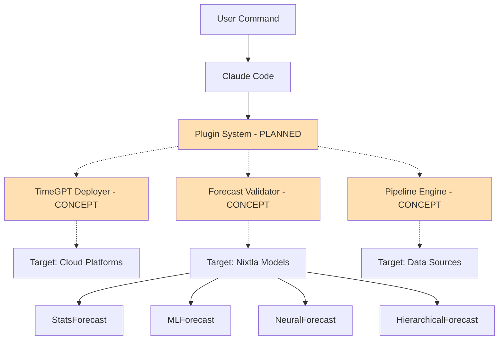

# Claude Code Plugins for Nixtla

[](https://github.com/jeremylongshore/claude-code-plugins-nixtla)
[](https://claude.ai/docs/claude-code)
[](https://docs.nixtla.io/)
[](./LICENSE)

> **Status**: Early Concept Repository – Initial plugin ideas built by Intent Solutions io for potential collaboration with Nixtla. Not affiliated with or endorsed by Nixtla. All implementations are conceptual and require proper API keys and environment setup.

> Claude Code plugins tailored for time series forecasting workflows. Automate TimeGPT deployments, validation pipelines, and Nixtlaverse integrations with natural language commands.

## Welcome

This repository contains Claude Code plugins specifically designed for Nixtla's time series ecosystem. These AI-powered tools transform complex ML workflows into simple commands, accelerating development velocity while maintaining the production standards that power forecasting at Microsoft, Walmart, and hundreds of other enterprises.

## Quick Start (Coming Soon)

```bash
# PLANNED: Plugin installation will work like this once plugins are developed
# /plugin marketplace add jeremylongshore/claude-code-plugins-nixtla
# /plugin install [plugin-name]@nixtla
```

**Current Status**: This repository contains the infrastructure and documentation for Claude Code plugins. Actual plugin implementations are in the planning phase. See our [Plugin Concepts](https://jeremylongshore.github.io/claude-code-plugins-nixtla/plugins) for the roadmap.

## Planned Architecture



**Note**: Orange boxes and dashed lines indicate planned functionality. See [Plugin Concepts](https://jeremylongshore.github.io/claude-code-plugins-nixtla/plugins) for detailed designs.

## Plugin Roadmap

### Current State
- ✅ Repository infrastructure established
- ✅ CI/CD workflows configured
- ✅ Documentation site deployed
- ⏳ Plugin implementations not yet started

### Planned Plugins (Concepts Only)

| Plugin Concept | Priority | Description | Design Status |
|--------|--------|-------------|----------|
| **TimeGPT Quickstart Builder** | High | Generate TimeGPT pipeline code | [Concept documented](https://jeremylongshore.github.io/claude-code-plugins-nixtla/plugins#1-timegpt-quickstart-pipeline-builder) |
| **Nixtla Bench Harness** | High | Compare multiple forecasting models | [Concept documented](https://jeremylongshore.github.io/claude-code-plugins-nixtla/plugins#2-nixtla-bench-harness-generator) |
| **Forecast Service Template** | Medium | FastAPI service scaffolding | [Concept documented](https://jeremylongshore.github.io/claude-code-plugins-nixtla/plugins#3-forecast-service-template-builder-fastapi--nixtla) |

### Future Ideas (Not Yet Designed)

- **data-connector**: Connect to various data sources
- **experiment-tracker**: Track and compare experiments
- **alert-manager**: Intelligent alerting for anomalies
- **report-generator**: Automated performance reports

## Roadmap

### Phase 1: Foundation
- Repository structure and documentation
- Core plugin architecture
- TimeGPT deployment automation
- Basic validation framework

### Phase 2: Integration
- Pipeline orchestration with Airflow/Prefect
- Advanced model comparison tools
- Real-time monitoring dashboards
- Team collaboration features

### Phase 3: Scale
- Multi-region deployment patterns
- Advanced AutoML integration
- Custom metric frameworks
- Enterprise SSO/RBAC

### Phase 4: Intelligence
- AI-powered optimization suggestions
- Automated hyperparameter tuning
- Anomaly detection and alerting
- Natural language reporting

## Vision: How Plugins Will Work

Once implemented, Claude Code plugins will transform complex workflows into simple commands:

### Planned Example 1: TimeGPT Pipeline Generation

```bash
# PLANNED FUNCTIONALITY - Not yet implemented
# User would describe their needs in natural language
# Plugin would generate complete Python code

# Future command: /timegpt-quickstart
# Would generate: timegpt_pipeline.py with error handling, logging, etc.
```

### Planned Example 2: Model Benchmarking

```bash
# PLANNED FUNCTIONALITY - Not yet implemented
# Compare multiple Nixtla models on your dataset

# Future command: /benchmark-models
# Would generate: benchmark_harness.py comparing TimeGPT, StatsForecast, etc.
```

### Planned Example 3: Service Scaffolding

```bash
# PLANNED FUNCTIONALITY - Not yet implemented
# Create production-ready API services

# Future command: /create-forecast-api
# Would generate: Complete FastAPI service with Docker, tests, and deployment configs
```

**Note**: These are conceptual examples showing the intended user experience. See our [detailed plugin designs](https://jeremylongshore.github.io/claude-code-plugins-nixtla/plugins) for implementation plans.

## Plugin Development Guide (Future)

Once the plugin system is implemented, creating custom plugins will follow this structure:

### Planned Plugin Structure
```
plugins/[plugin-name]/
├── .claude-plugin/
│   └── plugin.json        # Plugin metadata
├── commands/              # Slash commands
├── agents/               # AI agents
├── skills/              # Agent skills
└── README.md           # Documentation
```

### Example Plugin Configuration (Template)
```json
{
  "name": "plugin-name",
  "version": "0.1.0",
  "description": "Clear description",
  "author": {
    "name": "Your Name",
    "email": "email@example.com"
  }
}
```

### Development Resources
- [Plugin Architecture Documentation](./000-docs/002-AT-ARCH-plugin-architecture.md)
- [Document Standards](./000-docs/005-DR-META-document-standards.md)
- [Validation Script](./scripts/validate-all-plugins.sh) (ready for when plugins are created)

## Why Claude Code for ML Teams?

### Traditional Workflow Challenges
- **Deployment Complexity**: Each model requires unique configuration
- **Validation Overhead**: Manual comparison across models is time-consuming
- **Pipeline Maintenance**: Orchestration code becomes technical debt
- **Knowledge Silos**: Expertise locked in specific team members

### Claude Code Solution
- **Natural Language**: Deploy models by describing what you want
- **Intelligent Automation**: Claude understands context and handles details
- **Reusable Patterns**: Capture best practices in shareable plugins
- **Self-Documenting**: Every action is logged and explainable

## Security & Privacy

- **Private Repository**: Your code and data stay in your control
- **No External Dependencies**: Plugins run in your environment
- **Credential Management**: Secure handling via environment variables
- **Audit Trails**: Complete logging of all operations
- **Compliance Ready**: SOC2, HIPAA, GDPR compatible patterns

## Contributing

We welcome contributions! See [CONTRIBUTING.md](./CONTRIBUTING.md) for guidelines.

### Quick Contribution Guide

1. Fork the repository
2. Create a feature branch (`git checkout -b feature/amazing-plugin`)
3. Commit your changes (`git commit -m 'Add amazing plugin'`)
4. Push to the branch (`git push origin feature/amazing-plugin`)
5. Open a Pull Request

### Development Setup

```bash
# Clone the repository
git clone https://github.com/jeremylongshore/claude-code-plugins-nixtla.git
cd claude-code-plugins-nixtla

# Set up development environment
./scripts/setup-dev-environment.sh

# Run tests
pytest

# Validate plugins
./scripts/validate-plugins.sh
```

## Documentation

### Interactive Documentation Site

Visit our **[GitHub Pages documentation](https://jeremylongshore.github.io/claude-code-plugins-nixtla/)** for:

- **[Plugin Concepts](https://jeremylongshore.github.io/claude-code-plugins-nixtla/plugins)** - Detailed technical specifications for three initial plugin ideas
- **[Architecture Overview](https://jeremylongshore.github.io/claude-code-plugins-nixtla/architecture)** - Visual diagrams showing Claude Code + Nixtla integration
- **Interactive examples** with Mermaid diagrams and working code snippets
- **Implementation patterns** for production deployments

### Repository Documentation

- **[Technical Documentation](./000-docs/README.md)** - Complete planning and architecture documents
- **[API Reference](./000-docs/002-AT-ARCH-plugin-architecture.md)** - Plugin development specifications
- **[Document Standards](./000-docs/005-DR-META-document-standards.md)** - Filing system v3.0 reference

## Support

- **Priority Support**: Dedicated Slack channel at Intent Solutions IO workspace
- **Direct Contact**: jeremy@intentsolutions.io | Cell: 251.213.1115
- **Issues**: [GitHub Issues](https://github.com/jeremylongshore/claude-code-plugins-nixtla/issues)
- **Response Time**: Same-day response for all Nixtla inquiries

## License

This project is licensed under the MIT License - see the [LICENSE](./LICENSE) file for details.

## Acknowledgments

- **Nixtla Team**: For creating the incredible TimeGPT and Nixtlaverse ecosystem
- **Anthropic**: For Claude Code and the plugin architecture
- **Contributors**: Everyone who helps improve these tools

---

**Version**: 1.0.0
**Maintainer**: Jeremy Longshore (jeremy@intentsolutions.io)