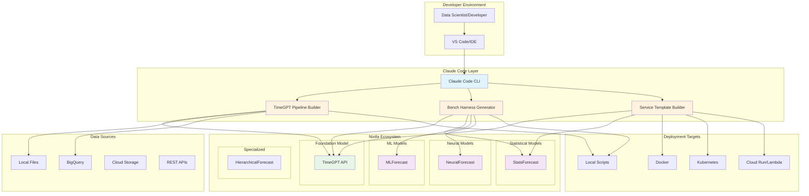
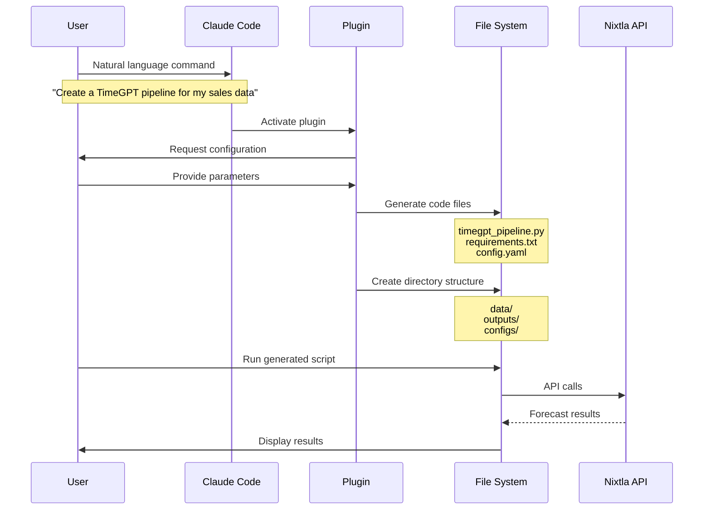
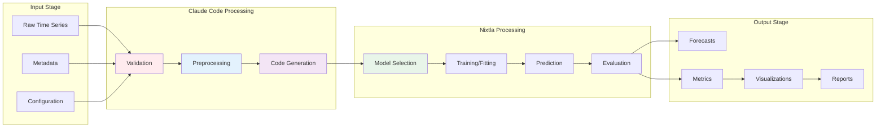
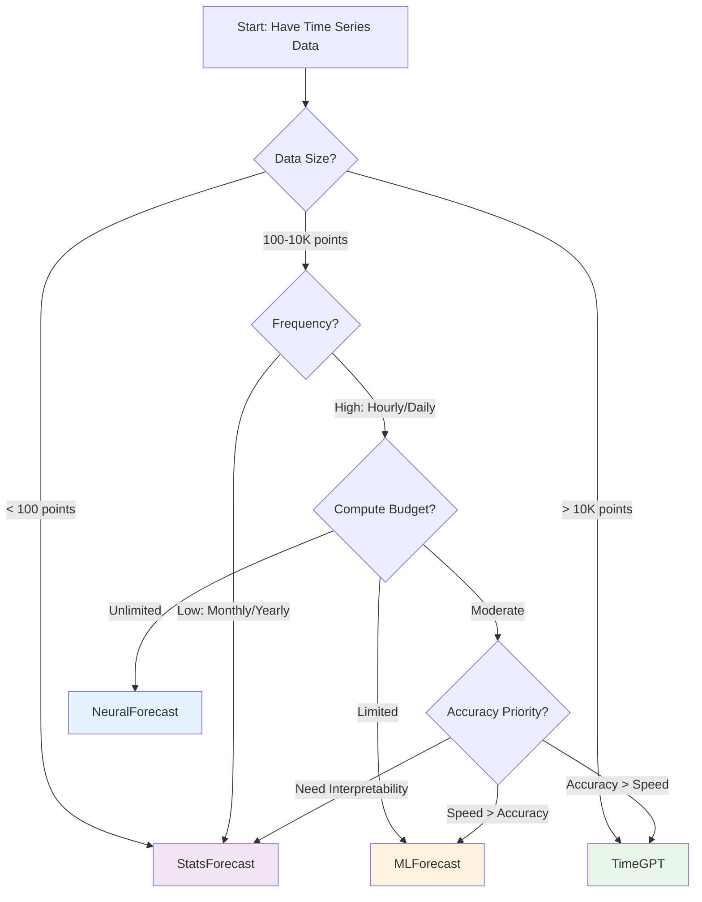
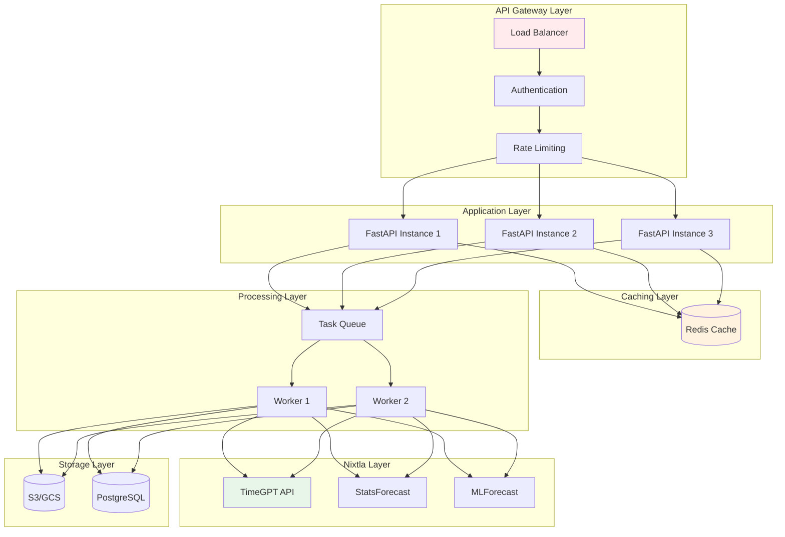
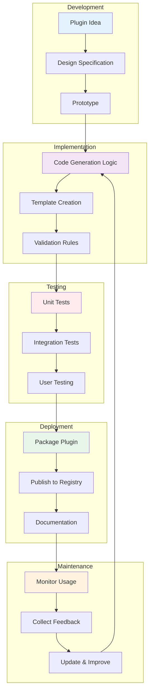
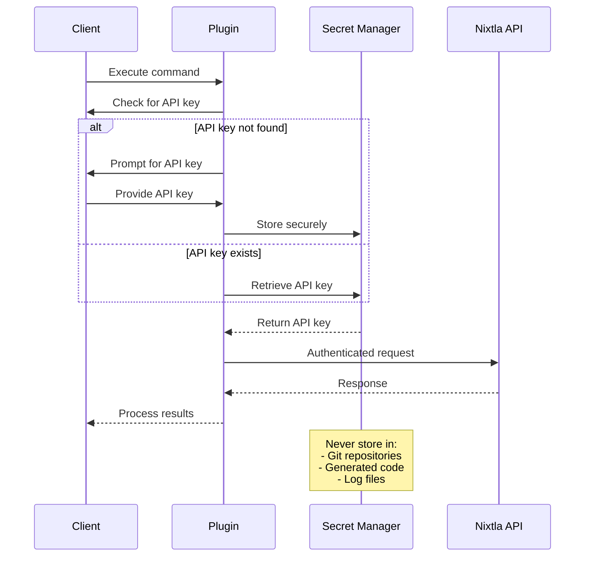
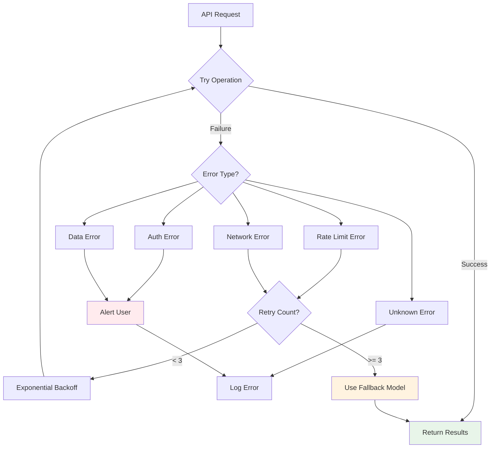
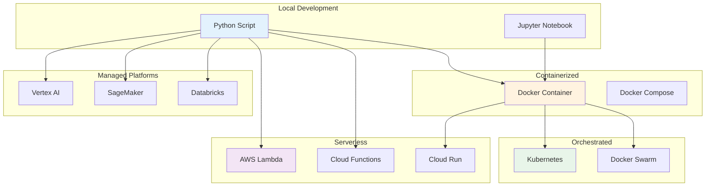
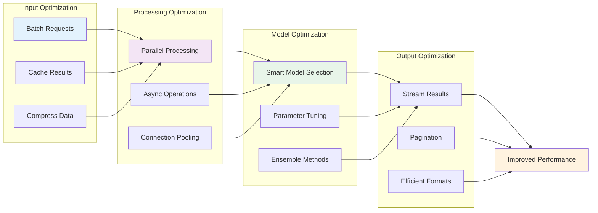

# Architecture Overview

This document illustrates how Intent Solutions io's Claude Code plugins integrate with the Nixtla ecosystem to accelerate time series forecasting workflows.

## High-Level Integration Architecture

## Plugin Execution Flow

## Data Flow Architecture

## Model Selection Decision Tree

## Service Architecture Pattern

## Plugin Development Lifecycle

## Security & Authentication Flow

## Error Handling Strategy

## Deployment Options

## Performance Optimization Strategy

## Technology Stack

| Layer | Technologies | Purpose |
|-------|-------------|---------|
| **Claude Code Plugins** | Python, Markdown, YAML | Natural language to code generation |
| **Nixtla Libraries** | TimeGPT, StatsForecast, MLForecast, NeuralForecast | Time series forecasting |
| **API Framework** | FastAPI, Pydantic, Uvicorn | REST API services |
| **Data Processing** | Pandas, NumPy, Polars | Data manipulation |
| **Caching** | Redis, Memcached | Response caching |
| **Containerization** | Docker, Docker Compose | Application packaging |
| **Orchestration** | Kubernetes, Helm | Container orchestration |
| **Monitoring** | Prometheus, Grafana | Metrics and observability |
| **Storage** | S3, GCS, PostgreSQL | Data persistence |
| **CI/CD** | GitHub Actions, GitLab CI | Automation pipelines |

## Integration Points

### 1. Data Ingestion
- **Local files**: CSV, Parquet, Excel
- **Databases**: PostgreSQL, MySQL, BigQuery
- **Cloud storage**: S3, GCS, Azure Blob
- **APIs**: REST endpoints, webhooks

### 2. Model Interfaces
- **TimeGPT**: REST API with Python SDK
- **StatsForecast**: Direct Python library
- **MLForecast**: Scikit-learn compatible
- **NeuralForecast**: PyTorch-based

### 3. Output Formats
- **Structured**: JSON, CSV, Parquet
- **Visualizations**: PNG, SVG, HTML
- **Reports**: Markdown, PDF, HTML
- **Dashboards**: Streamlit, Gradio

---

*Architecture designed by Intent Solutions io to maximize the value of Nixtla's forecasting ecosystem through intelligent automation.*